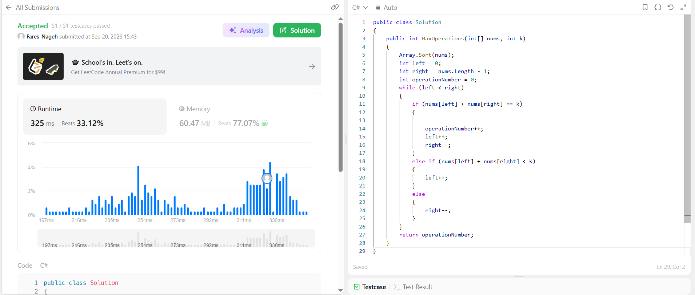

# Max Number of K-Sum Pairs

## Problem
https://leetcode.com/problems/max-number-of-k-sum-pairs/

## Accepted Submission
https://leetcode.com/problems/max-number-of-k-sum-pairs/submissions/2147679264/

## Accepted Screenshot

## Complexity
- Time Complexity: `O(n log n)`
- Auxiliary Space: `O(log n)`